# 🎮 SierraVault

**The definitive documentation archive for Sierra On-Line's gaming legacy.**

[](vault/Games/)
[](vault/Designers/)
[](LICENSE)

---

## Overview

SierraVault is a comprehensive Obsidian-based wiki documenting Sierra On-Line's complete gaming legacy from 1980 to present—flagship adventure series, acquired studios, fan remakes, and spiritual successors from Sierra alumni.

**Live Site:** [sierravault.net](https://sierravault.net) (Obsidian Publish) | **Mirror:** [quartz.sierravault.net](https://quartz.sierravault.net)

### What's Included

| Category | Count | Description |
|----------|-------|-------------|
| **Core Sierra** | ~200 | King's Quest, Space Quest, LSL, Police Quest, Gabriel Knight, etc. |
| **Dynamix** | 50+ | Flight sims, Incredible Machine, Tribes |
| **Impressions** | 20+ | Caesar, Pharaoh, Zeus city builders |
| **Coktel Vision** | 16 | Gobliiins, educational titles |
| **Sierra Partners** | 30+ | Valve, Relic, Monolith (creative partnerships) |
| **Fan Games** | 15+ | VGA remakes, fan sequels |
| **Alumni Successors** | 15+ | Hero-U, SpaceVenture, Gray Matter |

---

## 📚 Documentation

| Document | Description |
|----------|-------------|
| **[Contributing Guide](CONTRIBUTING.md)** | How to contribute, PR checklist |
| **[Style Guide](docs/STYLE_GUIDE.md)** | Content formatting standards |
| **[Inclusion Criteria](docs/INCLUSION_CRITERIA.md)** | What qualifies for inclusion |
| **[Quartz Hosting](docs/QUARTZ.md)** | Host your own mirror site |

---

## 📁 Repository Structure

```
sierravault/
├── .claude/                  # AI assistant task instructions
├── .github/                  # GitHub templates (issues, PRs)
├── scripts/                  # Scoring and validation tools
├── templates/                # Page templates
├── vault/                    # Obsidian vault (published content)
│   ├── .obsidian/            # Obsidian settings
│   ├── Games/                # 511 game pages across 73+ folders
│   │   ├── King's Quest/     # 10 games (1984-2015)
│   │   ├── Space Quest/      # 7 games (1986-1995)
│   │   ├── Quest for Glory/  # 6 games (1989-1998)
│   │   ├── Leisure Suit Larry/ # 12 games (1987-2020)
│   │   ├── Police Quest/     # 5 games (1987-1993)
│   │   ├── Gabriel Knight/   # 5 games (1993-2014)
│   │   ├── Laura Bow/        # 2 games (1989-1992)
│   │   ├── Dynamix/          # Action/sim titles
│   │   ├── Impressions/      # City builders
│   │   ├── Fan Games/        # VGA remakes & fan sequels
│   │   └── ...               # 60+ more folders
│   ├── Designers/            # 56 designer biographies
│   ├── Developers/           # 28 studio profiles
│   ├── Publishers/           # 23 publisher histories
│   ├── Series/               # 7 series overview pages
│   ├── Guides/               # 19 guides (compatibility, buying, engines)
│   ├── Technology/           # Engine documentation (AGI, SCI, GoldSrc)
│   ├── Reference/            # Timelines and indexes
│   ├── Images/               # Logos and assets
│   ├── Welcome.md            # Site homepage
│   ├── Site Index.md         # Complete game index (A-Z)
│   ├── News & Updates.md     # Project changelog
│   ├── publish.css           # Obsidian Publish styles
│   └── publish.js            # Obsidian Publish scripts
├── docs/                     # Documentation
│   ├── INCLUSION_CRITERIA.md # Game selection criteria
│   ├── QUARTZ.md             # Self-hosting guide
│   └── STYLE_GUIDE.md        # Content formatting standards
├── CLAUDE.md                 # AI assistant instructions
├── CONTRIBUTING.md           # Contribution guidelines
├── LICENSE                   # CC BY-NC license
└── README.md                 # This file
```

> **Note:** Research data, scoring history, and internal tooling are maintained in a separate private repository.

---

## 🔄 Content Pipeline

Our research and authoring process ensures accuracy and consistency:


### Pipeline Details

| Stage | Process | Tools |
|-------|---------|-------|
| **Discovery** | Find sources for each game | Brave Search, MobyGames API |
| **Crawling** | Extract content from sources | ScraperAPI, custom scrapers |
| **Enrichment** | Cross-reference and verify | Claude, GPT-4o, Kagi FastGPT |
| **Generation** | Write comprehensive pages | Claude Opus (AI-assisted) |
| **Scoring** | Dual-model quality check | Claude + GPT (both must pass 90%) |
| **Review** | Human editorial approval | Manual verification |
| **Publish** | Deploy to live site | Git + Obsidian Publish |

---

## 📊 Quality Standards

Every game page must meet these criteria:

```mermaid
flowchart TD
    A[New Page] --> B{15+ Citations?}
    B -->|No| C[Add More Sources]
    C --> B
    B -->|Yes| D{No Duplicate URLs?}
    D -->|No| E[Consolidate References]
    E --> D
    D -->|Yes| F{Structural Score ≥90%?}
    F -->|No| G[Fix Structure]
    G --> F
    F -->|Yes| H{LLM Score ≥90%?}
    H -->|No| I[Improve Content]
    I --> H
    H -->|Yes| J{Flagship Game?}
    J -->|Yes| K{Score ≥95%?}
    K -->|No| I
    K -->|Yes| L[✅ Ready for Review]
    J -->|No| L
```



### Requirements

- **15+ Citations** - Every claim backed by sources
- **No Duplicate URLs** - Each source used once
- **Structural Score ≥90%** - Follows template format
- **LLM Score ≥90%** - Accuracy verified by Claude + GPT
- **95%+ for Flagships** - Higher bar for major series

### Page Structure

Every game page follows a consistent format:

1. **Frontmatter** - Title, year, developer, platforms, etc.
2. **Overview** - 2-3 paragraph introduction with key citations
3. **Story Summary** - Plot without major spoilers
4. **Gameplay** - Interface, mechanics, puzzles
5. **Reception** - Contemporary and modern reviews with scores
6. **Development** - Team, budget, technical achievements
7. **Legacy** - Impact, sequels, remakes
8. **Downloads** - Purchase links and preservation resources
9. **Series Continuity** - Links to previous/next in series
10. **References** - 15-40+ numbered citations

---

## 🎯 Flagship Series

| Series | Games | Years | Creator |
|--------|-------|-------|---------|
| [King's Quest](vault/Games/King's%20Quest/) | 10 | 1984-2015 | Roberta Williams |
| [Space Quest](vault/Games/Space%20Quest/) | 7 | 1986-1995 | Two Guys from Andromeda |
| [Leisure Suit Larry](vault/Games/Leisure%20Suit%20Larry/) | 12 | 1987-2020 | Al Lowe |
| [Quest for Glory](vault/Games/Quest%20for%20Glory/) | 6 | 1989-1998 | Lori & Corey Cole |
| [Police Quest](vault/Games/Police%20Quest/) | 5 | 1987-1993 | Jim Walls |
| [Gabriel Knight](vault/Games/Gabriel%20Knight/) | 5 | 1993-2014 | Jane Jensen |
| [Laura Bow](vault/Games/Laura%20Bow/) | 2 | 1989-1992 | Roberta Williams |

---

## 🛠️ Local Development

### Prerequisites

- [Obsidian](https://obsidian.md/) (for viewing/editing)
- Python 3.10+ (for scripts)
- Git

### Setup

```bash
# Clone the repository
git clone https://github.com/d4rkwyng/sierravault.git
cd sierravault

# Open vault in Obsidian
# File → Open Vault → Select sierravault/vault folder

# For scoring scripts (optional)
python -m venv .venv
source .venv/bin/activate
pip install -r requirements.txt
```

### Running Quality Checks

```bash
# Score a single page (structural)
python scripts/score_page.py "vault/Games/King's Quest/1992 - King's Quest VI.md"

# Dual-model LLM scoring (requires API keys)
python scripts/score_page_llm.py "vault/Games/Space Quest/1991 - Space Quest IV.md" --model both

# Validate all wiki links
python scripts/validate_links.py
```

---

## 📈 Statistics

| Metric | Count |
|--------|-------|
| Total Games | 511 |
| Designer Bios | 56 |
| Developer Profiles | 28 |
| Publisher Histories | 23 |
| Series Overviews | 7 |
| Guides | 19 |

---

## 🤝 Contributing

We welcome contributions! See **[CONTRIBUTING.md](CONTRIBUTING.md)** for detailed guidelines.

**Quick checklist:**
- ✅ Every claim needs a citation (15+ per page)
- ✅ Follow the [Style Guide](docs/STYLE_GUIDE.md)
- ✅ Run quality checks before submitting
- ✅ Update `last_updated` in frontmatter

---

## 📬 Links

| Resource | URL |
|----------|-----|
| **Live Site** | [sierravault.net](https://sierravault.net) |
| **Quartz Mirror** | [quartz.sierravault.net](https://quartz.sierravault.net) |
| **GitHub Issues** | [Report bugs / Request features](https://github.com/d4rkwyng/sierravault/issues) |

Want to host your own mirror? See the **[Quartz Hosting Guide](docs/QUARTZ.md)**.

---

## 📜 License

Content is provided for educational and archival purposes. All trademarks belong to their respective owners (Sierra On-Line, Vivendi, Activision, Microsoft, etc.).

This is an unofficial fan archive with no affiliation to rights holders.

---

*Built with 🎮 by Sierra fans, for Sierra fans.*
